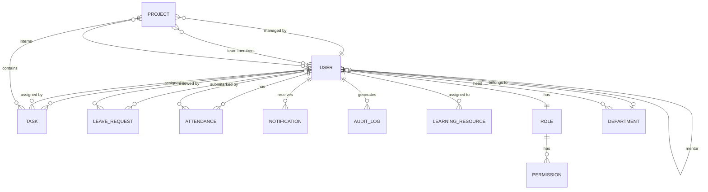

# 📚 OMS — Office Workspace Management System

## Complete Project Documentation & API Reference

> **Version:** 2.0.1 · **Author:** Movi Cloud Labs  
> **Last Updated:** July 2026

---

## Table of Contents

- [1. System Overview](#1-system-overview)
- [2. Architecture & Tech Stack](#2-architecture--tech-stack)
- [3. Project Structure](#3-project-structure)
- [4. Data Models & Relationships](#4-data-models--relationships)
- [5. Roles & Responsibilities](#5-roles--responsibilities)
- [6. How Roles Work Together — Cross-Role Workflows](#6-how-roles-work-together--cross-role-workflows)
- [7. Middleware Pipeline](#7-middleware-pipeline)
- [8. Permission System (RBAC)](#8-permission-system-rbac)
- [9. Complete API Catalog (143 Endpoints)](#9-complete-api-catalog-143-endpoints)
- [10. Notification System](#10-notification-system)
- [11. Getting Started](#11-getting-started)

---

## 1. System Overview

**OMS (Office Workspace Management System)** is a full-stack role-based office management platform that enables organizations to manage their workforce end-to-end — from onboarding employees and interns, managing projects and tasks, tracking attendance and leave, to generating reports and maintaining audit trails.

### What This System Does

```
┌──────────────────────────────────────────────────────────────────┐
│                     OMS — At a Glance                            │
├──────────────────────────────────────────────────────────────────┤
│  👤 User Management      → Create, archive, restore, offboard   │
│  🏢 Department Management→ Organize teams by department          │
│  📋 Project Management   → Full lifecycle project tracking       │
│  ✅ Task Management      → Assign, track, review, approve tasks  │
│  📅 Attendance Tracking  → Mark, export, review daily attendance │
│  🏖️ Leave Management     → Apply, approve, reject, balance       │
│  🎓 Intern Management    → Mentoring, learning, performance      │
│  🔐 RBAC Access Control  → Granular permission-based access      │
│  📊 Reports & Analytics  → Headcount, health, summaries          │
│  🔔 Notifications        → In-app, email, real-time alerts       │
│  📝 Audit Logging        → Immutable compliance trail            │
│  ⚙️ System Settings      → Branding, security, SMTP, config      │
└──────────────────────────────────────────────────────────────────┘
```

---

## 2. Architecture & Tech Stack

### Backend

| Layer | Technology | Purpose |
|---|---|---|
| **Runtime** | Node.js ≥ 18 | Server-side JavaScript |
| **Framework** | Express.js 4.18 | REST API framework |
| **Database** | MongoDB (Mongoose 8.0) | Document database with ODM |
| **Auth** | JWT (jsonwebtoken 9.0) | Stateless authentication |
| **Hashing** | bcryptjs 2.4 | Password hashing |
| **File Uploads** | Multer 1.4 | Multipart form data |
| **Email** | Nodemailer 9.0 | SMTP email delivery |
| **Security** | Helmet 7.1, CORS, Rate-limiting | Security headers & protection |
| **Reports** | PDFKit, XLSX | PDF & Excel export |
| **Logging** | Morgan | HTTP request logging |
| **Geolocation** | geoip-lite | Audit log geolocation |
| **User Agent** | ua-parser-js | Browser/OS detection for audits |

### Frontend

| Layer | Technology | Purpose |
|---|---|---|
| **Framework** | React 18.3 | Component-based UI |
| **Build Tool** | Vite 5.4 | Fast HMR dev server |
| **Routing** | React Router DOM 6.26 | Client-side routing |
| **Styling** | Tailwind CSS 3.4 | Utility-first CSS |
| **HTTP Client** | Axios 1.7 | API communication |
| **Charts** | Recharts 3.8 | Data visualization |
| **Icons** | Lucide React 1.17 | SVG icon library |
| **Animations** | Framer Motion 12.38 | Page transitions & micro-animations |
| **Toasts** | react-hot-toast 2.4 | Notification toasts |
| **Calendar** | react-calendar 6.0 | Date picker component |
| **Dates** | date-fns 3.6 | Date utility library |

### Architecture Diagram

```
┌─────────────────────────────────────────────────────────────────────────┐
│                          CLIENT (Browser)                               │
│  ┌──────────────────────────────────────────────────────────────────┐   │
│  │         React SPA (Vite + Tailwind + Framer Motion)              │   │
│  │   ┌─────────┐ ┌─────────┐ ┌─────────┐ ┌─────────┐ ┌──────────┐│   │
│  │   │  Admin   │ │   HR    │ │   PMO   │ │Employee │ │  Intern  ││   │
│  │   │Dashboard │ │Dashboard│ │Dashboard│ │Dashboard│ │Dashboard ││   │
│  │   └────┬─────┘ └────┬────┘ └────┬────┘ └────┬────┘ └────┬─────┘│   │
│  │        └─────────────┴──────────┬┴───────────┴───────────┘      │   │
│  │                                 │                                │   │
│  │                    Axios HTTP Client (JWT Bearer)                │   │
│  └─────────────────────────────────┼────────────────────────────────┘   │
└────────────────────────────────────┼────────────────────────────────────┘
                                     │ HTTPS
┌────────────────────────────────────┼────────────────────────────────────┐
│                          SERVER (Node.js)                               │
│  ┌─────────────────────────────────┼────────────────────────────────┐   │
│  │                    Express.js Application                        │   │
│  │                                 │                                │   │
│  │  ┌─────────┐ ┌─────────┐ ┌─────┴─────┐ ┌──────────┐            │   │
│  │  │ Helmet  │→│  CORS   │→│Rate Limit │→│  Morgan   │            │   │
│  │  └─────────┘ └─────────┘ └───────────┘ └──────────┘            │   │
│  │                                 │                                │   │
│  │  ┌─────────┐ ┌─────────┐ ┌───────────┐ ┌──────────┐            │   │
│  │  │ Protect │→│  RBAC   │→│  Scope    │→│  Audit   │            │   │
│  │  │  (JWT)  │ │(Perms)  │ │(HR/PMO/EMP)│ │  Logger  │            │   │
│  │  └─────────┘ └─────────┘ └───────────┘ └──────────┘            │   │
│  │                                 │                                │   │
│  │  ┌──────────────────────────────┴───────────────────────────┐   │   │
│  │  │                    Route Handlers                         │   │   │
│  │  │  /api/auth  /api/admin  /api/hr  /api/pmo  /api/employee │   │   │
│  │  │  /api/me    /api/notifications   /api/intern              │   │   │
│  │  └──────────────────────────────┬───────────────────────────┘   │   │
│  │                                 │                                │   │
│  │  ┌──────────────────────────────┴───────────────────────────┐   │   │
│  │  │                    Controllers                            │   │   │
│  │  │    Business logic, validation, response formatting        │   │   │
│  │  └──────────────────────────────┬───────────────────────────┘   │   │
│  │                                 │                                │   │
│  │  ┌──────────────────────────────┴───────────────────────────┐   │   │
│  │  │               Mongoose Models (18 Models)                 │   │   │
│  │  │  User, Role, Permission, Department, Project, Task,       │   │   │
│  │  │  Attendance, LeaveRequest, LeaveBalance, Notification,    │   │   │
│  │  │  AuditLog, Settings, Report, ReportRun, LearningResource, │   │   │
│  │  │  ArchivedUser, Announcement, InternRequest                │   │   │
│  │  └──────────────────────────────┬───────────────────────────┘   │   │
│  └─────────────────────────────────┼────────────────────────────────┘   │
└────────────────────────────────────┼────────────────────────────────────┘
                                     │
                            ┌────────┴────────┐
                            │    MongoDB       │
                            │   (Atlas/Local)  │
                            └─────────────────┘
```

---

## 3. Project Structure

```
OMS/
├── backend/
│   ├── server.js                          # Entry point — connects DB, starts Express
│   ├── package.json                       # Dependencies & scripts
│   ├── .env                               # Environment variables (secrets, DB URI)
│   ├── uploads/                           # File uploads (avatars, attachments, logos)
│   └── src/
│       ├── app.js                         # Express app config (middleware, routes, CORS)
│       ├── config/
│       │   ├── db.js                      # MongoDB connection
│       │   ├── seed.js                    # Initial data seeding (roles, permissions)
│       │   ├── seedUsers.js               # Demo user seeding
│       │   ├── addIntern.js               # Quick intern creation script
│       │   └── resetForDemo.js            # Reset to demo state
│       ├── middleware/
│       │   ├── auth.js                    # JWT verification (protect middleware)
│       │   ├── rbac.js                    # Permission checking (requirePermission)
│       │   ├── hrScope.js                 # HR data scoping
│       │   ├── pmoScope.js                # PMO data scoping
│       │   ├── employeeScope.js           # Employee self-only scope
│       │   ├── audit.js                   # Auto audit logging
│       │   ├── upload.js                  # Multer file upload
│       │   └── errorHandler.js            # Global error handler
│       ├── models/                        # 18 Mongoose models
│       │   ├── User.js                    # Central user model (all roles)
│       │   ├── Role.js                    # Role definitions with permissions
│       │   ├── Permission.js              # Granular permissions (resource.action)
│       │   ├── Department.js              # Org departments
│       │   ├── Project.js                 # Projects with teams & milestones
│       │   ├── Task.js                    # Tasks with subtasks, comments, attachments
│       │   ├── Attendance.js              # Daily attendance records
│       │   ├── LeaveRequest.js            # Leave applications
│       │   ├── LeaveBalance.js            # Annual leave balances per user
│       │   ├── Notification.js            # In-app notifications
│       │   ├── AuditLog.js                # Immutable audit trail
│       │   ├── Settings.js                # System-wide settings
│       │   ├── Report.js                  # Report definitions
│       │   ├── ReportRun.js               # Report execution history
│       │   ├── LearningResource.js        # Intern learning materials
│       │   ├── ArchivedUser.js            # Soft-deleted user archive
│       │   ├── Announcement.js            # Dashboard announcements
│       │   └── InternRequest.js           # PMO intern requests
│       ├── controllers/
│       │   ├── auth.controller.js         # Login, register, password reset
│       │   ├── notification.controller.js # Notification CRUD
│       │   ├── admin/                     # Admin controllers (9 files)
│       │   ├── hr/                        # HR controllers (8 files)
│       │   ├── pmo/                       # PMO controllers (7 files)
│       │   ├── employee/                  # Employee controllers (7 files)
│       │   └── intern/                    # Intern controllers (5 files)
│       ├── routes/
│       │   ├── auth.routes.js             # Auth routes
│       │   ├── me.routes.js               # Self-service profile routes
│       │   ├── notification.routes.js     # Notification routes
│       │   ├── admin/                     # Admin routes (9 files)
│       │   ├── hr/                        # HR routes (8 files)
│       │   ├── pmo/                       # PMO routes (7 files)
│       │   ├── employee/                  # Employee routes (7 files)
│       │   └── intern/                    # Intern routes (5 files)
│       ├── utils/
│       │   ├── apiResponse.js             # Standard response helpers
│       │   └── clientInfo.js              # Client IP/UA/geo extraction
│       └── scripts/                       # Utility scripts
│
├── frontend/
│   ├── index.html                         # SPA entry point
│   ├── package.json                       # Frontend dependencies
│   ├── vite.config.js                     # Vite configuration
│   ├── tailwind.config.js                 # Tailwind CSS config
│   └── src/
│       ├── App.jsx                        # Root component (routing, auth context)
│       ├── main.jsx                       # React DOM render
│       ├── index.css                      # Global styles
│       ├── api/                           # Axios API service modules
│       ├── components/                    # Reusable UI components
│       ├── contexts/                      # React Context providers (Auth, Theme)
│       ├── routes/                        # Route guards & role-based routing
│       ├── utils/                         # Helper utilities
│       └── pages/
│           ├── Profile.jsx                # Shared profile page
│           ├── auth/                      # Login, ForgotPassword, ResetPassword
│           ├── admin/                     # 22 Admin pages
│           ├── hr/                        # 16 HR pages
│           ├── pmo/                       # 15 PMO pages
│           ├── employee/                  # 8 Employee pages
│           └── intern/                    # 11 Intern pages
│
├── start.bat                              # Windows startup script
├── README.md                              # Project readme
└── LICENSE                                # License file
```

---

## 4. Data Models & Relationships

### Entity-Relationship Diagram



### 18 Mongoose Models

| # | Model | Collection | Key Fields | Purpose |
|---|---|---|---|---|
| 1 | **User** | `users` | name, email, employeeId, role, department, manager, hrManager, mentor, status | Central user for all roles |
| 2 | **Role** | `roles` | name, slug, permissions[], isSystem | Role definitions (Super Admin, Admin, HR, PMO, Employee, Intern) |
| 3 | **Permission** | `permissions` | name, resource, action, riskLevel, status | Granular permissions (`users.create`, `reports.export`) |
| 4 | **Department** | `departments` | name, code, head, parentDepartment, status | Organizational units |
| 5 | **Project** | `projects` | name, code, manager, team[], interns[], milestones[], status, healthStatus | Projects with team & tracking |
| 6 | **Task** | `tasks` | title, project, assignedBy, assignedTo, status, subtasks[], comments[], attachments[] | Task with full lifecycle |
| 7 | **Attendance** | `attendances` | user, date, status, checkIn, checkOut, markedBy | One record per user per day |
| 8 | **LeaveRequest** | `leaverequests` | user, type, fromDate, toDate, days, status, reviewedBy | Leave applications |
| 9 | **LeaveBalance** | `leavebalances` | user, year, casual, sick, annual, emergency, compensatory | Annual leave quotas |
| 10 | **Notification** | `notifications` | recipient, type, title, message, link, read, sender | In-app notification |
| 11 | **AuditLog** | `auditlogs` | user, action, module, details, ipAddress, browser, os, location, result | Immutable audit trail |
| 12 | **Settings** | `settings` | general, security, notifications, branding, system, hr | Global configuration |
| 13 | **Report** | `reports` | name, type, config | Report definitions |
| 14 | **ReportRun** | `reportruns` | report, status, startedAt, completedAt, output | Report execution log |
| 15 | **LearningResource** | `learningresources` | title, type, url, assignedTo, assignedBy, status | Intern learning material |
| 16 | **ArchivedUser** | `archivedusers` | originalId, userData, archivedBy, reason | Soft-deleted user backup |
| 17 | **Announcement** | `announcements` | title, message, createdBy | Dashboard announcements |
| 18 | **InternRequest** | `internrequests` | requestedBy, project, count, skills, status | PMO intern requisition |

### Key Relationships

```
User
 ├── role          → Role (required)
 ├── department    → Department
 ├── manager       → User (direct report)
 ├── hrManager     → User (assigned HR)
 ├── mentor        → User (intern's mentor)
 ├── pmoLead       → User (assigned PMO lead)
 └── project       → Project (primary assignment)

Project
 ├── manager       → User (PMO Lead)
 ├── hrManager     → User (assigned HR)
 ├── department    → Department
 ├── team[]        → User[] (employees + roles)
 └── interns[]     → User[] (assigned interns)

Task
 ├── project       → Project
 ├── assignedBy    → User (PMO Lead / HR)
 ├── assignedTo    → User (employee / intern)
 └── approvedBy    → User (reviewer)
```

---

## 5. Roles & Responsibilities

The system has **6 built-in roles**, each with distinct capabilities and data access scopes.

### Role Hierarchy

```
                    ┌─────────────────┐
                    │   SUPER ADMIN   │  ← God mode: bypasses ALL checks
                    └────────┬────────┘
                             │
                    ┌────────┴────────┐
                    │     ADMIN       │  ← System configuration, user management
                    └────────┬────────┘
                             │
              ┌──────────────┼──────────────┐
              │              │              │
     ┌────────┴────────┐  ┌─┴───────────┐ ┌┴────────────────┐
     │   HR MANAGER    │  │  PMO LEAD   │ │ (other admin     │
     │                 │  │             │ │  created roles)   │
     └────────┬────────┘  └──────┬──────┘ └─────────────────┘
              │                  │
              └────────┬─────────┘
                       │
              ┌────────┴────────┐
              │    EMPLOYEE     │  ← Standard team member
              └────────┬────────┘
                       │
              ┌────────┴────────┐
              │     INTERN      │  ← Limited access, learning focused
              └─────────────────┘
```

---

### 🛡️ Super Admin

| Aspect | Details |
|---|---|
| **Slug** | `super-admin` |
| **Access** | Unrestricted — bypasses ALL RBAC permission checks |
| **Scope** | No scope filters applied (sees all data globally) |
| **Purpose** | System owner, initial setup, emergency access |

**Key Capabilities:**
- Full access to every endpoint in the system
- Cannot be deleted or deactivated
- Bypasses maintenance mode
- Can access all module dashboards

---

### 🔧 Admin

| Aspect | Details |
|---|---|
| **Slug** | `admin` |
| **Access** | All `/api/admin/*` endpoints + dashboard |
| **Scope** | Organization-wide (all users, all departments) |
| **Purpose** | Day-to-day system administration |

**Key Capabilities:**
- **User Management**: Create, update, archive, restore, permanently delete users
- **Department Management**: Create and organize departments
- **Role & Permission Management**: Create roles, assign permissions via Access Matrix
- **Audit Logs**: View, filter, and export the immutable audit trail
- **Reports**: Define, run, and export system-wide reports
- **Settings**: Configure security policies, SMTP email, branding, maintenance mode
- **Dashboard**: View system statistics, create/delete announcements

**What Admin CANNOT Do:**
- Directly manage projects or tasks (that's PMO's domain)
- Mark attendance or approve leaves (that's HR's domain)
- Cannot bypass Super Admin restrictions

---

### 👥 HR Manager

| Aspect | Details |
|---|---|
| **Slug** | `hr-manager` |
| **Access** | All `/api/hr/*` endpoints |
| **Scope** | `hrScope` — only sees employees explicitly assigned (`hrManager` field) + employees sharing projects with this HR |
| **Purpose** | People operations — onboarding, attendance, leave, performance |

**Key Capabilities:**
- **Employee Management**: View scoped employees, add notes, rate performance
- **Onboarding**: Track onboarding checklists, reassign HR managers
- **Attendance**: Mark attendance for employees, export attendance data
- **Leave Management**: Review/approve/reject leave requests, allocate leave balances
- **Intern Oversight**: View interns, assign mentors, manage learning resources, rate performance
- **Task Management**: View task boards for employees and interns, assign tasks
- **Own Leave & Tasks**: Apply for own leave, manage own tasks
- **Reports**: Headcount, attendance summary, leave summary

**How HR Scope Works:**
```
HR Manager sees employees via TWO paths:

1. EXPLICIT: Users where user.hrManager === HR's _id
2. IMPLICIT: Users in ANY project that the HR is also a team member of

                    ┌──────────────┐
                    │   HR Manager │
                    └──────┬───────┘
                           │
            ┌──────────────┼──────────────┐
            │              │              │
     user.hrManager   Project Team    Project Interns
       matches HR     membership      membership
            │              │              │
            ▼              ▼              ▼
      ┌──────────┐  ┌──────────┐  ┌──────────┐
      │Employee A│  │Employee B│  │ Intern C  │
      └──────────┘  └──────────┘  └──────────┘
```

---

### 📊 PMO Lead (Project Management Office)

| Aspect | Details |
|---|---|
| **Slug** | `pmo-lead` |
| **Access** | All `/api/pmo/*` endpoints |
| **Scope** | `pmoScope` — only sees projects where `project.manager === PMO's _id` |
| **Purpose** | Project delivery — projects, tasks, team, milestones, approvals |

**Key Capabilities:**
- **Project Management**: Full CRUD on own projects, manage team composition, add milestones
- **Task Management**: Create, assign, update, delete tasks within own projects
- **Team Management**: View team members, check availability, view team leave calendar
- **Intern Management**: View interns in own projects, rate performance, assign learning resources, request new interns
- **Approvals**: Review pending leave requests, review task submissions, manage onboarding approvals
- **Dashboard**: Project portfolio overview with health statuses
- **Reports**: Project health reports, resource warnings

**How PMO Scope Works:**
```
PMO Lead only manages their OWN projects:

     ┌──────────────┐
     │   PMO Lead   │
     └──────┬───────┘
            │
            │  project.manager === PMO's _id
            │
     ┌──────┴──────┐
     │  Project A  │──→ Team Members, Tasks, Interns, Milestones
     │  Project B  │──→ Team Members, Tasks, Interns, Milestones
     └─────────────┘
     
     Project C (another PMO's project) → ❌ NOT visible
```

---

### 💼 Employee

| Aspect | Details |
|---|---|
| **Slug** | `employee` |
| **Access** | All `/api/employee/*` endpoints |
| **Scope** | `employeeScope` — strictly limited to own data only |
| **Purpose** | Day-to-day work — tasks, projects, leave, attendance |

**Key Capabilities:**
- **Profile**: View and update own profile, change password
- **Tasks**: View assigned tasks, update status, toggle subtasks, add comments and attachments
- **Projects**: View projects they're part of, see team members
- **Team**: View colleagues in same projects
- **Attendance**: View own attendance records
- **Leave**: Check balance, apply for leave, cancel pending requests
- **Notifications**: View, mark read, delete own notifications

**What Employee CANNOT Do:**
- Cannot see other employees' tasks, attendance, or leave
- Cannot create projects or tasks
- Cannot approve/reject anything
- Cannot access admin, HR, or PMO modules

---

### 🎓 Intern

| Aspect | Details |
|---|---|
| **Slug** | `intern` |
| **Access** | All `/api/intern/*` endpoints |
| **Scope** | Self-only (via `protect` middleware) |
| **Purpose** | Internship work — tasks, learning, attendance |

**Key Capabilities:**
- **Profile**: View and update own profile, change password
- **Tasks**: View assigned tasks, update status, toggle subtasks, add comments and attachments
- **Attendance**: View own attendance records
- **Leave**: View leave requests, check balance, apply for leave, cancel pending
- **Learning**: View assigned learning resources, update progress status

**What Intern CANNOT Do:**
- Cannot see other interns' data
- Cannot see projects directly (only tasks assigned to them)
- No team visibility
- No notification management (handled via shared `/api/notifications`)
- Cannot access any management modules

**Intern-Specific Fields on User Model:**
- `college` — Educational institution
- `internshipStart` / `internshipEnd` — Internship date range
- `mentor` — Assigned mentor (Employee or PMO Lead)
- `pmoLead` — Assigned PMO Lead
- `performanceRatings[]` — Weekly ratings from HR/PMO

---

## 6. How Roles Work Together — Cross-Role Workflows

### 🔄 Workflow 1: New Employee Onboarding

```
 ┌─────────┐    ┌─────────┐    ┌─────────┐    ┌─────────┐
 │  ADMIN  │───▶│   HR    │───▶│   PMO   │───▶│EMPLOYEE │
 │         │    │         │    │         │    │         │
 │ Creates │    │Onboards │    │Assigns  │    │ Starts  │
 │  user   │    │employee │    │to project│   │ working │
 └─────────┘    └─────────┘    └─────────┘    └─────────┘
```

**Step-by-step:**

| Step | Who | Action | API Used |
|---|---|---|---|
| 1 | **Admin** | Creates a new user account with role=Employee | `POST /api/admin/users` |
| 2 | **System** | Auto-generates employee ID (`EMP-2026-001`), sends notification | Automatic |
| 3 | **Admin** | Assigns user to a department, assigns HR manager | `PUT /api/admin/users/:id` |
| 4 | **HR** | Sees new employee in pending onboarding list | `GET /api/hr/onboarding/pending` |
| 5 | **HR** | Completes onboarding checklist (welcome email, ID card, system access, etc.) | `PATCH /api/hr/onboarding/:id/checklist` |
| 6 | **HR** | Adds notes about the employee | `POST /api/hr/employees/:id/notes` |
| 7 | **PMO** | Adds employee to a project team | `POST /api/pmo/projects/:id/team` |
| 8 | **PMO** | Creates tasks for the new employee | `POST /api/pmo/tasks` |
| 9 | **Employee** | Logs in, sees dashboard, starts working on tasks | `GET /api/employee/tasks` |

---

### 🔄 Workflow 2: Intern Lifecycle

```
 ┌─────────┐    ┌─────────┐    ┌─────────┐    ┌─────────┐    ┌─────────┐
 │  ADMIN  │───▶│   HR    │───▶│   PMO   │───▶│ INTERN  │───▶│ HR/PMO  │
 │         │    │         │    │         │    │         │    │         │
 │ Creates │    │Assigns  │    │Assigns  │    │ Learns  │    │ Rates   │
 │ intern  │    │mentor   │    │to proj. │    │& works  │    │ perf.   │
 └─────────┘    └─────────┘    └─────────┘    └─────────┘    └─────────┘
```

| Step | Who | Action | API |
|---|---|---|---|
| 1 | **Admin** | Creates intern account (`INT-2026-001`) | `POST /api/admin/users` |
| 2 | **HR** | Assigns a mentor to the intern | `PATCH /api/hr/interns/:id/assign-mentor` |
| 3 | **HR** | Assigns learning resources (videos, docs, courses) | `POST /api/hr/interns/:id/learning` |
| 4 | **PMO** | Assigns intern to a project | `POST /api/pmo/projects/:id/interns` |
| 5 | **PMO** | Creates tasks for the intern | `POST /api/pmo/tasks` |
| 6 | **Intern** | Works on tasks, updates status | `PATCH /api/intern/tasks/:id/status` |
| 7 | **Intern** | Completes learning resources | `PATCH /api/intern/learning/:id/status` |
| 8 | **HR** | Reviews and rates intern performance weekly | `POST /api/hr/interns/:id/performance` |
| 9 | **PMO** | Also rates intern from project perspective | `POST /api/pmo/interns/:id/performance` |

---

### 🔄 Workflow 3: Task Lifecycle

```
 ┌─────────┐    ┌──────────────┐    ┌─────────────┐    ┌──────────────┐
 │   PMO   │───▶│   EMPLOYEE   │───▶│    PMO      │───▶│   SYSTEM     │
 │         │    │   / INTERN   │    │             │    │              │
 │ Creates │    │   Works on   │    │  Reviews &  │    │  Audit log   │
 │  task   │    │   task       │    │  approves   │    │  + notify    │
 └─────────┘    └──────────────┘    └─────────────┘    └──────────────┘
```

| Step | Who | Action | API | Status |
|---|---|---|---|---|
| 1 | **PMO** | Creates task, assigns to employee | `POST /api/pmo/tasks` | `Todo` |
| 2 | **System** | Sends notification to assignee | Automatic | — |
| 3 | **Employee** | Starts working, updates status | `PATCH /api/employee/tasks/:id/status` | `In Progress` |
| 4 | **Employee** | Completes subtasks | `PATCH /api/employee/tasks/:id/subtasks/:subtaskId` | — |
| 5 | **Employee** | Adds comments/attachments | `POST /api/employee/tasks/:id/comments` | — |
| 6 | **Employee** | Submits for review | `PATCH /api/employee/tasks/:id/status` | `In Review` |
| 7 | **PMO** | Sees task in review queue | `GET /api/pmo/approvals/tasks` | — |
| 8 | **PMO** | Approves or requests changes | `PATCH /api/pmo/tasks/:id/status` | `Done` or `In Progress` |
| 9 | **System** | Creates audit log entry | Automatic | — |

---

### 🔄 Workflow 4: Leave Request Flow

```
 ┌──────────────┐    ┌─────────┐    ┌─────────┐    ┌──────────┐
 │  EMPLOYEE    │───▶│   HR    │───▶│   PMO   │    │  SYSTEM  │
 │  / INTERN    │    │         │    │(notified)│   │          │
 │              │    │Reviews  │    │         │    │ Updates  │
 │ Applies for  │    │& decides│    │ Sees in │    │ balance  │
 │    leave     │    │         │    │calendar │    │          │
 └──────────────┘    └─────────┘    └─────────┘    └──────────┘
```

| Step | Who | Action | API |
|---|---|---|---|
| 1 | **Employee** | Checks leave balance | `GET /api/employee/leave/balance` |
| 2 | **Employee** | Applies for leave | `POST /api/employee/leave/apply` |
| 3 | **System** | Sends notification to HR manager | Automatic |
| 4 | **HR** | Sees pending leave request | `GET /api/hr/leaves/pending` |
| 5 | **HR** | Approves or rejects with note | `PATCH /api/hr/leaves/:id/review` |
| 6 | **System** | Updates leave balance, notifies employee | Automatic |
| 7 | **PMO** | Sees approved leave on team calendar | `GET /api/pmo/team/leaves` |
| 8 | **PMO** | Adjusts project timeline if needed | `PATCH /api/pmo/projects/:id/milestones/:milestoneId` |

---

### 🔄 Workflow 5: User Offboarding (Deletion Cascade)

```
 ┌─────────┐    ┌─────────┐    ┌──────────┐
 │  ADMIN  │───▶│ SYSTEM  │───▶│ ARCHIVED │
 │         │    │         │    │  USERS   │
 │Archives │    │Cascades │    │          │
 │  user   │    │cleanup  │    │ Stored   │
 └─────────┘    └─────────┘    └──────────┘
```

| Step | Who | Action | API |
|---|---|---|---|
| 1 | **Admin** | Previews deletion impact | `GET /api/admin/users/:id/deletion-impact` |
| 2 | **Admin** | Archives user (soft delete) | `DELETE /api/admin/users/:id` |
| 3 | **System** | Moves user data to `ArchivedUser` collection | Automatic |
| 4 | **System** | Sets `needsReassignment=true` on orphaned tasks | Automatic |
| 5 | **System** | Removes user from project teams | Automatic |
| 6 | **System** | Cancels pending leave requests | Automatic |
| 7 | **Admin** | Can restore if needed | `POST /api/admin/users/archived/:archivedId/restore` |
| 8 | **Admin** | Or permanently delete | `DELETE /api/admin/users/archived/:archivedId/permanent` |

---

### 🔄 Workflow 6: Project Lifecycle

```
 ┌─────────┐    ┌─────────┐    ┌─────────┐    ┌──────────────┐    ┌─────────┐
 │   PMO   │───▶│   PMO   │───▶│   HR    │───▶│  EMPLOYEES   │───▶│   PMO   │
 │         │    │         │    │(optional)│   │  & INTERNS   │    │         │
 │ Creates │    │ Builds  │    │ Assigns │    │              │    │Monitors │
 │ project │    │  team   │    │ HR mgr  │    │ Execute work │    │ health  │
 └─────────┘    └─────────┘    └─────────┘    └──────────────┘    └─────────┘
```

| Step | Who | Action | API |
|---|---|---|---|
| 1 | **PMO** | Creates project with details | `POST /api/pmo/projects` |
| 2 | **PMO** | Adds team members | `POST /api/pmo/projects/:id/team` |
| 3 | **PMO** | Adds milestones | `POST /api/pmo/projects/:id/milestones` |
| 4 | **PMO** | Assigns interns | `POST /api/pmo/projects/:id/interns` |
| 5 | **PMO** | Creates tasks for team | `POST /api/pmo/tasks` |
| 6 | **Employees** | Work on tasks | `PATCH /api/employee/tasks/:id/status` |
| 7 | **PMO** | Monitors project health | `GET /api/pmo/reports/health` |
| 8 | **PMO** | Reviews warnings | `GET /api/pmo/reports/warnings` |
| 9 | **PMO** | Updates milestones | `PATCH /api/pmo/projects/:id/milestones/:milestoneId` |

---

### 🔄 Workflow 7: Attendance Management

```
 ┌─────────┐    ┌──────────────┐    ┌──────────────┐
 │   HR    │───▶│  EMPLOYEES   │    │    ADMIN     │
 │         │    │  & INTERNS   │    │              │
 │ Marks   │    │              │    │  Views in    │
 │ daily   │    │ View own     │    │  reports     │
 │attendanc│    │ records      │    │              │
 └─────────┘    └──────────────┘    └──────────────┘
```

| Step | Who | Action | API |
|---|---|---|---|
| 1 | **HR** | Marks attendance for scoped employees | `POST /api/hr/attendance/mark` |
| 2 | **HR** | Can update a record if needed | `PATCH /api/hr/attendance/:id` |
| 3 | **Employee** | Views own attendance | `GET /api/employee/attendance` |
| 4 | **Intern** | Views own attendance | `GET /api/intern/attendance` |
| 5 | **HR** | Generates attendance summary | `GET /api/hr/reports/attendance-summary` |
| 6 | **HR** | Exports attendance data | `GET /api/hr/attendance/export` |

---

### Cross-Role Interaction Matrix

This matrix shows which roles interact with each other and through what mechanisms:

```
              ADMIN    HR       PMO      EMPLOYEE   INTERN
  ADMIN       ─────   assigns  assigns    creates   creates
                      HR mgr   PMO lead   account   account
  
  HR          reports  ─────   shares     onboards   mentors
              to              project    marks      assigns
                              scope     attendance  learning
  
  PMO         reports  shares   ─────    assigns     assigns
              to      project           tasks       tasks to
                      scope                         project
  
  EMPLOYEE    ─       leave    tasks      ─────      ─
                      requests submits
                      
  INTERN      ─       perf.    tasks      ─           ─────
                      rated    submits
```

---

## 7. Middleware Pipeline

Every request passes through a layered middleware pipeline. Here's the exact execution order:

### Global Middleware (Applied to ALL requests)

```
Request
  │
  ├── 1. Helmet          → Security headers (CSP, XSS, etc.)
  ├── 2. UA Client Hints → Requests browser platform info
  ├── 3. CORS            → Cross-origin validation
  ├── 4. Body Parser     → JSON (10MB limit) + URL-encoded
  ├── 5. Compression     → gzip response compression
  ├── 6. Morgan          → HTTP logging (dev only)
  ├── 7. Rate Limiter    → 300 req/15min (2000 in dev)
  │      └── Auth Limiter → 10 login attempts/15min
  └── 8. Static Files    → /uploads directory
```

### Per-Route Middleware Stack

```
Route Handler
  │
  ├── protect              → JWT verify → load user → populate role & permissions
  │     │                       └── Checks: token exists, valid, user exists, 
  │     │                           active status, password not changed, 
  │     │                           maintenance mode
  │
  ├── requirePermission    → RBAC check against role's permissions
  │     │                       └── Super Admin always passes
  │     │                       └── Logs DENIED attempts to AuditLog
  │
  ├── hrScope / pmoScope   → Data scoping (limits query results)
  │   / employeeScope           └── HR: assigned employees + shared projects
  │                              └── PMO: own projects only
  │                              └── Employee: self only
  │
  ├── auditLog             → Wraps res.json() to auto-log successful writes
  │                              └── Captures: user, action, module, IP, UA, geo
  │
  ├── upload               → Multer file handling (avatars, attachments, logos)
  │
  └── Controller           → Business logic execution
```

### Middleware Details

| Middleware | File | Applied To | Purpose |
|---|---|---|---|
| `protect` | `middleware/auth.js` | All authenticated routes | JWT verification, user loading with role & permissions populated, status check, maintenance mode check |
| `requirePermission(resource, action)` | `middleware/rbac.js` | Admin, HR, PMO routes | Checks user's role permissions against required `resource.action`. Super Admin bypasses all checks. Failed attempts are audit-logged. |
| `hrScope` | `middleware/hrScope.js` | HR module routes | Restricts HR to: (a) users with `hrManager === HR's _id`, (b) users in shared projects. Attaches `req.scopeFilter`. Super Admin bypasses. |
| `pmoScope` | `middleware/pmoScope.js` | PMO module routes | Restricts PMO to projects where `manager === PMO's _id`. Attaches `req.projectFilter`. Super Admin bypasses. |
| `employeeScope` | `middleware/employeeScope.js` | Employee module routes | Ensures only `employee` or `super-admin` role slugs can access. Sets `req.employeeId = req.user._id`. |
| `auditLog(action, module)` | `middleware/audit.js` | Write operations | Wraps `res.json()` to intercept successful responses (status < 400) and auto-create audit entries with client info (IP, browser, OS, geo). |
| `upload` / `setUploadType` | `middleware/upload.js` | File upload endpoints | Multer middleware for handling multipart file uploads (avatars, task attachments, logos). |
| `errorHandler` | `middleware/errorHandler.js` | Global (last middleware) | Catches unhandled errors, formats consistent error responses. |

---

## 8. Permission System (RBAC)

### How It Works

```
1. Admin defines PERMISSIONS
   └── e.g. "users.create", "tasks.read", "reports.export"

2. Admin creates ROLES
   └── Each role has a set of permissions

3. Admin manages ACCESS MATRIX
   └── Visual grid: Role × Permission = ✅ or ❌

4. User gets assigned a ROLE
   └── On every API request:
       a) protect → loads user with role.permissions
       b) requirePermission('Users', 'create') → checks if role has "users.create"
       c) If no → 403 + audit log entry
       d) If yes → proceed to controller
```

### Permission Resources & Actions

| Resource | Available Actions |
|---|---|
| **Users** | `create`, `read`, `update`, `delete`, `manage` |
| **Departments** | `create`, `read`, `update`, `delete` |
| **Roles** | `create`, `read`, `update`, `delete` |
| **Projects** | `create`, `read`, `update`, `delete` |
| **Tasks** | `create`, `read`, `update`, `delete` |
| **Attendance** | `read`, `manage`, `export` |
| **Leave** | `read`, `approve`, `manage` |
| **Interns** | `read`, `manage` |
| **Reports** | `read`, `export` |
| **Audit Logs** | `read`, `export` |
| **Settings** | `read`, `update` |
| **Permissions** | `read`, `update` |

### Permission Format

Permissions are stored in the format: `resource.action`

```
Examples:
  users.create       → Can create new users
  tasks.read         → Can view tasks
  attendance.manage  → Can mark/update attendance
  leave.approve      → Can approve/reject leave requests
  reports.export     → Can export reports
  settings.update    → Can modify system settings
```

### Risk Levels

Each permission has a risk level indicator:

| Risk Level | Examples | Meaning |
|---|---|---|
| **Low** | `tasks.read`, `users.read` | Read-only, no impact |
| **Medium** | `tasks.create`, `attendance.manage` | Creates/modifies data |
| **High** | `users.delete`, `settings.update` | Destructive or security-impacting |
| **Critical** | `roles.delete`, `audit_logs.export` | System-critical operations |

---

## 9. Complete API Catalog (143 Endpoints)

### Grand Summary

| Module | # of APIs | Middleware |
|---|---|---|
| System (Health) | 2 | None |
| Auth (Public) | 4 | None |
| Auth (Protected) | 2 | `protect` |
| Me (All Roles) | 3 | `protect` |
| Notifications (All Roles) | 4 | `protect` |
| **Admin** | **39** | `protect` + `requirePermission` |
| **HR** | **30** | `protect` + `hrScope` + `requirePermission` |
| **PMO** | **28** | `protect` + `pmoScope` + `requirePermission` |
| **Employee** | **18** | `protect` + `employeeScope` |
| **Intern** | **13** | `protect` |
| **GRAND TOTAL** | **143** | — |

---

### 9.1 System — Health Check (2 APIs)

> No authentication required.

| # | Method | Endpoint | Description |
|---|---|---|---|
| 1 | `GET` | `/` | API root — confirms server is running |
| 2 | `GET` | `/api/health` | Health check (Mongo status, env, timestamp) |

---

### 9.2 Auth — Public (4 APIs)

> No authentication required.

| # | Method | Endpoint | Description |
|---|---|---|---|
| 1 | `POST` | `/api/auth/login` | Login with email or employeeId |
| 2 | `POST` | `/api/auth/forgot-password` | Request password reset link |
| 3 | `POST` | `/api/auth/reset-password` | Set new password via reset token |
| 4 | `POST` | `/api/auth/refresh` | Refresh access token |

---

### 9.3 Auth — Protected (2 APIs)

> Requires `protect` middleware (any authenticated user).

| # | Method | Endpoint | Description |
|---|---|---|---|
| 1 | `POST` | `/api/auth/logout` | Invalidate refresh token |
| 2 | `GET` | `/api/auth/me` | Get current authenticated user |

---

### 9.4 Me — Self-Service (3 APIs)

> Requires `protect`. Available to **every authenticated user**.

| # | Method | Endpoint | Description |
|---|---|---|---|
| 1 | `GET` | `/api/me/profile` | Get own profile with role, dept, manager |
| 2 | `PATCH` | `/api/me/profile` | Update own profile (name, bio, avatar, links, etc.) |
| 3 | `POST` | `/api/me/change-password` | Change own password |

---

### 9.5 Notifications — All Roles (4 APIs)

> Requires `protect`. Available to **every authenticated user**.

| # | Method | Endpoint | Description |
|---|---|---|---|
| 1 | `GET` | `/api/notifications` | Get own notifications |
| 2 | `PATCH` | `/api/notifications/read-all` | Mark all notifications as read |
| 3 | `PATCH` | `/api/notifications/:id/read` | Mark single notification as read |
| 4 | `DELETE` | `/api/notifications/:id` | Delete a notification |

---

### 9.6 Admin Module (39 APIs)

> Requires `protect` + RBAC permission checks.  
> Dashboard endpoints additionally require `admin` or `super-admin` role slug.

#### 9.6a Users Management (12 APIs)

| # | Method | Endpoint | Permission | Description |
|---|---|---|---|---|
| 1 | `GET` | `/api/admin/users` | `Users:read` | List all users (filters + pagination) |
| 2 | `POST` | `/api/admin/users` | `Users:create` | Create a new user |
| 3 | `GET` | `/api/admin/users/archived` | `Users:read` | List all archived users |
| 4 | `POST` | `/api/admin/users/archived/:archivedId/restore` | `Users:manage` | Restore archived user |
| 5 | `DELETE` | `/api/admin/users/archived/:archivedId/permanent` | `Users:delete` | Permanently delete archived user |
| 6 | `GET` | `/api/admin/users/:id` | `Users:read` | Get single user details |
| 7 | `GET` | `/api/admin/users/:id/projects` | `Users:read` | Get all projects a user is in |
| 8 | `GET` | `/api/admin/users/:id/deletion-impact` | `Users:delete` | Preview deletion consequences |
| 9 | `PUT` | `/api/admin/users/:id` | `Users:update` | Update user |
| 10 | `DELETE` | `/api/admin/users/:id` | `Users:delete` | Archive user (offboarding cascade) |
| 11 | `PATCH` | `/api/admin/users/:id/status` | `Users:update` | Toggle user active/inactive status |
| 12 | `POST` | `/api/admin/users/:id/reset-password` | `Users:manage` | Reset a user's password |

#### 9.6b Departments Management (6 APIs)

| # | Method | Endpoint | Permission | Description |
|---|---|---|---|---|
| 1 | `GET` | `/api/admin/departments` | `Departments:read` | List all departments |
| 2 | `POST` | `/api/admin/departments` | `Departments:create` | Create a department |
| 3 | `GET` | `/api/admin/departments/:id` | `Departments:read` | Get department by ID |
| 4 | `PUT` | `/api/admin/departments/:id` | `Departments:update` | Update a department |
| 5 | `DELETE` | `/api/admin/departments/:id` | `Departments:delete` | Delete a department |
| 6 | `GET` | `/api/admin/departments/:id/members` | `Departments:read` | List members in a department |

#### 9.6c Roles Management (7 APIs)

| # | Method | Endpoint | Permission | Description |
|---|---|---|---|---|
| 1 | `GET` | `/api/admin/roles` | `Roles:read` | List all roles |
| 2 | `POST` | `/api/admin/roles` | `Roles:create` | Create a role |
| 3 | `GET` | `/api/admin/roles/:id` | `Roles:read` | Get role by ID |
| 4 | `PUT` | `/api/admin/roles/:id` | `Roles:update` | Update a role |
| 5 | `DELETE` | `/api/admin/roles/:id` | `Roles:delete` | Delete a role |
| 6 | `GET` | `/api/admin/roles/:id/users` | `Roles:read` | List users assigned to a role |
| 7 | `POST` | `/api/admin/roles/:id/permissions` | `Roles:update` | Update role permissions |

#### 9.6d Permissions (2 APIs)

| # | Method | Endpoint | Permission | Description |
|---|---|---|---|---|
| 1 | `GET` | `/api/admin/permissions` | `Roles:read` | List all permissions |
| 2 | `GET` | `/api/admin/permissions/:id` | `Roles:read` | Get permission by ID |

#### 9.6e Access Matrix (2 APIs)

| # | Method | Endpoint | Permission | Description |
|---|---|---|---|---|
| 1 | `GET` | `/api/admin/access-matrix` | `Roles:update` | Get the full access matrix |
| 2 | `PUT` | `/api/admin/access-matrix` | `Roles:update` | Update the access matrix |

#### 9.6f Audit Logs (3 APIs)

| # | Method | Endpoint | Permission | Description |
|---|---|---|---|---|
| 1 | `GET` | `/api/admin/audit-logs` | `Audit Logs:read` | List audit logs (filtered) |
| 2 | `GET` | `/api/admin/audit-logs/export` | `Audit Logs:export` | Export audit logs |
| 3 | `GET` | `/api/admin/audit-logs/:id` | `Audit Logs:read` | Get single audit log entry |

#### 9.6g Reports (6 APIs)

| # | Method | Endpoint | Permission | Description |
|---|---|---|---|---|
| 1 | `GET` | `/api/admin/reports` | `Reports:read` | List all report definitions |
| 2 | `POST` | `/api/admin/reports/:id/run` | `Reports:read` | Trigger a report run |
| 3 | `GET` | `/api/admin/reports/:id/runs/:runId/status` | `Reports:read` | Get report run status |
| 4 | `GET` | `/api/admin/reports/:id/export` | `Reports:read` | Export a report |
| 5 | `DELETE` | `/api/admin/reports/:id` | `Reports:read` | Delete a report |
| 6 | `PATCH` | `/api/admin/reports/:id/archive` | `Reports:read` | Archive a report |

#### 9.6h Settings (5 APIs)

| # | Method | Endpoint | Permission | Description |
|---|---|---|---|---|
| 1 | `GET` | `/api/admin/settings` | `Settings:read` | Get system settings |
| 2 | `PUT` | `/api/admin/settings` | `Settings:update` | Update system settings |
| 3 | `POST` | `/api/admin/settings/reset` | `Settings:update` | Reset settings to defaults |
| 4 | `POST` | `/api/admin/settings/test-email` | `Settings:update` | Test email configuration |
| 5 | `POST` | `/api/admin/settings/upload-logo` | `Settings:update` | Upload company logo |

#### 9.6i Dashboard (3 APIs)

| # | Method | Endpoint | Permission | Description |
|---|---|---|---|---|
| 1 | `GET` | `/api/admin/dashboard/stats` | Admin role only | Get dashboard statistics |
| 2 | `POST` | `/api/admin/dashboard/announcements` | Admin role only | Create announcement |
| 3 | `DELETE` | `/api/admin/dashboard/announcements/:id` | Admin role only | Delete announcement |

> **Admin Total: 12 + 6 + 7 + 2 + 2 + 3 + 6 + 5 + 3 = ✅ 39 APIs**

---

### 9.7 HR Module (30 APIs)

> Requires `protect` + `hrScope` middleware (scopes data to HR's assigned employees).  
> RBAC permission checks on most endpoints.

#### 9.7a Employees (6 APIs)

| # | Method | Endpoint | Permission | Description |
|---|---|---|---|---|
| 1 | `GET` | `/api/hr/employees` | `Users:read` | List HR-scoped employees |
| 2 | `GET` | `/api/hr/employees/:id` | `Users:read` | Get employee details |
| 3 | `GET` | `/api/hr/employees/:id/attendance` | `Attendance:read` | Get employee's attendance records |
| 4 | `GET` | `/api/hr/employees/:id/leaves` | `Leave:read` | Get employee's leave records |
| 5 | `POST` | `/api/hr/employees/:id/notes` | `Users:update` | Add a note to employee record |
| 6 | `POST` | `/api/hr/employees/:id/performance` | `Users:update` | Add performance rating |

#### 9.7b Onboarding (5 APIs)

| # | Method | Endpoint | Permission | Description |
|---|---|---|---|---|
| 1 | `GET` | `/api/hr/onboarding/pending` | `Users:read` | List pending onboarding items |
| 2 | `GET` | `/api/hr/onboarding/completed` | `Users:read` | List completed onboarding items |
| 3 | `GET` | `/api/hr/onboarding/hr-list` | `Users:read` | Get list of HR managers |
| 4 | `PATCH` | `/api/hr/onboarding/:id/checklist` | `Users:update` | Update onboarding checklist |
| 5 | `PATCH` | `/api/hr/onboarding/:id/reassign` | `Users:update` | Reassign HR manager |

#### 9.7c Attendance (4 APIs)

| # | Method | Endpoint | Permission | Description |
|---|---|---|---|---|
| 1 | `GET` | `/api/hr/attendance` | `Attendance:read` | Get attendance records |
| 2 | `POST` | `/api/hr/attendance/mark` | `Attendance:manage` | Mark attendance for employee |
| 3 | `GET` | `/api/hr/attendance/export` | `Attendance:export` | Export attendance data |
| 4 | `PATCH` | `/api/hr/attendance/:id` | `Attendance:manage` | Update an attendance record |

#### 9.7d Leaves (8 APIs)

| # | Method | Endpoint | Permission | Description |
|---|---|---|---|---|
| 1 | `GET` | `/api/hr/leaves/my/balance` | — (self) | Get HR's own leave balance |
| 2 | `GET` | `/api/hr/leaves/my` | — (self) | Get HR's own leave requests |
| 3 | `POST` | `/api/hr/leaves/my/apply` | — (self) | HR apply for own leave |
| 4 | `DELETE` | `/api/hr/leaves/my/:id` | — (self) | HR cancel own leave |
| 5 | `GET` | `/api/hr/leaves/pending` | `Leave:read` | Get pending leave requests |
| 6 | `GET` | `/api/hr/leaves` | `Leave:read` | Get all leave requests |
| 7 | `PATCH` | `/api/hr/leaves/:id/review` | `Leave:approve` | Approve/reject a leave request |
| 8 | `POST` | `/api/hr/leaves/balance` | `Leave:manage` | Allocate leave balance |

#### 9.7e Interns (7 APIs)

| # | Method | Endpoint | Permission | Description |
|---|---|---|---|---|
| 1 | `GET` | `/api/hr/interns` | `Interns:read` | List interns |
| 2 | `GET` | `/api/hr/interns/:id` | `Interns:read` | Get intern by ID |
| 3 | `POST` | `/api/hr/interns/:id/performance` | `Interns:manage` | Add performance rating |
| 4 | `PATCH` | `/api/hr/interns/:id/assign-mentor` | `Interns:manage` | Assign mentor to intern |
| 5 | `GET` | `/api/hr/interns/:id/learning` | `Interns:read` | Get intern's learning resources |
| 6 | `POST` | `/api/hr/interns/:id/learning` | `Interns:manage` | Assign learning resource |
| 7 | `DELETE` | `/api/hr/interns/:id/learning/:resourceId` | `Interns:manage` | Delete learning resource |

#### 9.7f Reports (3 APIs)

| # | Method | Endpoint | Permission | Description |
|---|---|---|---|---|
| 1 | `GET` | `/api/hr/reports/headcount` | `Users:read` | Get headcount report |
| 2 | `GET` | `/api/hr/reports/attendance-summary` | `Attendance:read` | Get attendance summary |
| 3 | `GET` | `/api/hr/reports/leave-summary` | `Leave:read` | Get leave summary |

#### 9.7g Tasks (9 APIs)

| # | Method | Endpoint | Permission | Description |
|---|---|---|---|---|
| 1 | `GET` | `/api/hr/tasks/my` | — (self) | Get HR's own tasks |
| 2 | `GET` | `/api/hr/tasks/my/:id` | — (self) | Get single own task |
| 3 | `PATCH` | `/api/hr/tasks/my/:id/status` | — (self) | Update own task status |
| 4 | `PATCH` | `/api/hr/tasks/my/:id/subtasks/:index` | — (self) | Toggle subtask completion |
| 5 | `POST` | `/api/hr/tasks/my/:id/comments` | — (self) | Add comment to own task |
| 6 | `POST` | `/api/hr/tasks/my/:id/attachments` | — (self) | Upload attachment to own task |
| 7 | `GET` | `/api/hr/tasks/interns` | — | View intern task board |
| 8 | `GET` | `/api/hr/tasks/employees` | — | View employee task board |
| 9 | `POST` | `/api/hr/tasks/assign` | — | Assign a task to team member |

#### 9.7h Projects (2 APIs)

| # | Method | Endpoint | Permission | Description |
|---|---|---|---|---|
| 1 | `GET` | `/api/hr/projects` | — (self) | Get HR's own projects |
| 2 | `GET` | `/api/hr/projects/:id` | — (self) | Get project by ID |

> **HR Total: 6 + 5 + 4 + 8 + 7 + 3 + 9 + 2 = ✅ 30 APIs** (some sub-routes share a single route file)

---

### 9.8 PMO Module (28 APIs)

> Requires `protect` + `pmoScope` middleware.  
> RBAC permission checks on most endpoints.

#### 9.8a Dashboard (1 API)

| # | Method | Endpoint | Permission | Description |
|---|---|---|---|---|
| 1 | `GET` | `/api/pmo/dashboard` | `Projects:read` | Get PMO dashboard statistics |

#### 9.8b Projects (10 APIs)

| # | Method | Endpoint | Permission | Description |
|---|---|---|---|---|
| 1 | `GET` | `/api/pmo/projects` | `Projects:read` | List all projects |
| 2 | `POST` | `/api/pmo/projects` | `Projects:create` | Create a project |
| 3 | `GET` | `/api/pmo/projects/:id` | `Projects:read` | Get project by ID |
| 4 | `PUT` | `/api/pmo/projects/:id` | `Projects:update` | Update a project |
| 5 | `DELETE` | `/api/pmo/projects/:id` | `Projects:delete` | Delete a project |
| 6 | `POST` | `/api/pmo/projects/:id/team` | `Projects:update` | Add team members to project |
| 7 | `DELETE` | `/api/pmo/projects/:id/team/:userId` | `Projects:update` | Remove team member from project |
| 8 | `POST` | `/api/pmo/projects/:id/interns` | `Interns:manage` | Assign interns to project |
| 9 | `POST` | `/api/pmo/projects/:id/milestones` | `Projects:update` | Add milestone |
| 10 | `PATCH` | `/api/pmo/projects/:id/milestones/:milestoneId` | `Projects:update` | Update milestone |

#### 9.8c Tasks (8 APIs)

| # | Method | Endpoint | Permission | Description |
|---|---|---|---|---|
| 1 | `GET` | `/api/pmo/tasks` | `Tasks:read` | List all tasks |
| 2 | `POST` | `/api/pmo/tasks` | `Tasks:create` | Create a task |
| 3 | `GET` | `/api/pmo/tasks/:id` | `Tasks:read` | Get task by ID |
| 4 | `PUT` | `/api/pmo/tasks/:id` | `Tasks:update` | Update a task |
| 5 | `PATCH` | `/api/pmo/tasks/:id/status` | `Tasks:update` | Update task status |
| 6 | `POST` | `/api/pmo/tasks/:id/comments` | `Tasks:update` | Add comment to task |
| 7 | `POST` | `/api/pmo/tasks/:id/attachments` | `Tasks:update` | Upload attachment to task |
| 8 | `DELETE` | `/api/pmo/tasks/:id` | `Tasks:delete` | Delete a task |

#### 9.8d Team (4 APIs)

| # | Method | Endpoint | Permission | Description |
|---|---|---|---|---|
| 1 | `GET` | `/api/pmo/team` | `Projects:read` | List team members |
| 2 | `GET` | `/api/pmo/team/available` | — | Get available (unassigned) members |
| 3 | `GET` | `/api/pmo/team/leaves` | `Projects:read` | Get team leave calendar |
| 4 | `GET` | `/api/pmo/team/:id` | `Projects:read` | Get team member by ID |

#### 9.8e Interns (7 APIs)

| # | Method | Endpoint | Permission | Description |
|---|---|---|---|---|
| 1 | `GET` | `/api/pmo/interns` | `Interns:read` | List interns |
| 2 | `GET` | `/api/pmo/interns/:id` | `Interns:read` | Get intern by ID |
| 3 | `POST` | `/api/pmo/interns/:id/performance` | `Interns:manage` | Add performance rating |
| 4 | `POST` | `/api/pmo/interns/request` | `Interns:manage` | Request interns |
| 5 | `GET` | `/api/pmo/interns/:id/learning` | `Interns:read` | Get intern's learning resources |
| 6 | `POST` | `/api/pmo/interns/:id/learning` | `Interns:manage` | Assign learning resource |
| 7 | `DELETE` | `/api/pmo/interns/:id/learning/:resourceId` | `Interns:manage` | Delete learning resource |

#### 9.8f Approvals (6 APIs)

| # | Method | Endpoint | Permission | Description |
|---|---|---|---|---|
| 1 | `GET` | `/api/pmo/approvals/leaves` | `Leave:read` | Get pending leave requests |
| 2 | `GET` | `/api/pmo/approvals/leave-overview` | `Leave:read` | Get leave overview/calendar |
| 3 | `GET` | `/api/pmo/approvals/tasks` | `Tasks:read` | Get tasks in review status |
| 4 | `GET` | `/api/pmo/approvals/onboarding` | `Users:read` | Get pending onboarding items |
| 5 | `POST` | `/api/pmo/approvals/onboarding/:id/approve` | `Users:update` | Approve onboarding |
| 6 | `PUT` | `/api/pmo/approvals/:id` | `Tasks:update` | Update an approval |

#### 9.8g Reports (3 APIs)

| # | Method | Endpoint | Permission | Description |
|---|---|---|---|---|
| 1 | `GET` | `/api/pmo/reports` | `Reports:read` | List available reports |
| 2 | `GET` | `/api/pmo/reports/health` | `Projects:read` | Get project health report |
| 3 | `GET` | `/api/pmo/reports/warnings` | `Users:read` | Get resource warnings |

> **PMO Total: 1 + 10 + 8 + 4 + 7 + 6 + 3 = ✅ 28 APIs** (unique route registrations)

---

### 9.9 Employee Module (18 APIs)

> Requires `protect` + `employeeScope` middleware.  
> No RBAC — scoped to self only.

#### 9.9a Profile (3 APIs)

| # | Method | Endpoint | Description |
|---|---|---|---|
| 1 | `GET` | `/api/employee/profile` | Get own profile |
| 2 | `PATCH` | `/api/employee/profile` | Update own profile |
| 3 | `POST` | `/api/employee/profile/change-password` | Change own password |

#### 9.9b Tasks (6 APIs)

| # | Method | Endpoint | Description |
|---|---|---|---|
| 1 | `GET` | `/api/employee/tasks` | Get assigned tasks |
| 2 | `GET` | `/api/employee/tasks/:id` | Get task details |
| 3 | `PATCH` | `/api/employee/tasks/:id/status` | Update task status |
| 4 | `POST` | `/api/employee/tasks/:id/comments` | Add comment to task |
| 5 | `POST` | `/api/employee/tasks/:id/attachments` | Upload attachment |
| 6 | `PATCH` | `/api/employee/tasks/:id/subtasks/:subtaskId` | Toggle subtask |

#### 9.9c Projects (3 APIs)

| # | Method | Endpoint | Description |
|---|---|---|---|
| 1 | `GET` | `/api/employee/projects` | Get own projects |
| 2 | `GET` | `/api/employee/projects/team` | Get team members in projects |
| 3 | `GET` | `/api/employee/projects/:id` | Get project by ID |

#### 9.9d Team (2 APIs)

| # | Method | Endpoint | Description |
|---|---|---|---|
| 1 | `GET` | `/api/employee/team` | List team/colleagues |
| 2 | `GET` | `/api/employee/team/:userId` | Get team member details |

#### 9.9e Attendance (1 API)

| # | Method | Endpoint | Description |
|---|---|---|---|
| 1 | `GET` | `/api/employee/attendance` | Get own attendance records |

#### 9.9f Leave (4 APIs)

| # | Method | Endpoint | Description |
|---|---|---|---|
| 1 | `GET` | `/api/employee/leave/balance` | Get own leave balance |
| 2 | `GET` | `/api/employee/leave/requests` | Get own leave requests |
| 3 | `POST` | `/api/employee/leave/apply` | Apply for leave |
| 4 | `DELETE` | `/api/employee/leave/:id` | Cancel a leave request |

#### 9.9g Notifications (4 APIs)

| # | Method | Endpoint | Description |
|---|---|---|---|
| 1 | `GET` | `/api/employee/notifications` | Get own notifications |
| 2 | `PATCH` | `/api/employee/notifications/read-all` | Mark all read |
| 3 | `PATCH` | `/api/employee/notifications/:id/read` | Mark single read |
| 4 | `DELETE` | `/api/employee/notifications/:id` | Delete notification |

> **Employee Total: 3 + 6 + 3 + 2 + 1 + 4 + 4 = ✅ 18 APIs** (excluding shared `/api/notifications`)

---

### 9.10 Intern Module (13 APIs)

> Requires `protect`. No RBAC — scoped to self only.

#### 9.10a Profile (3 APIs)

| # | Method | Endpoint | Description |
|---|---|---|---|
| 1 | `GET` | `/api/intern/profile` | Get own profile |
| 2 | `PATCH` | `/api/intern/profile` | Update own profile |
| 3 | `POST` | `/api/intern/profile/change-password` | Change own password |

#### 9.10b Tasks (6 APIs)

| # | Method | Endpoint | Description |
|---|---|---|---|
| 1 | `GET` | `/api/intern/tasks` | Get assigned tasks |
| 2 | `GET` | `/api/intern/tasks/:id` | Get task details |
| 3 | `PATCH` | `/api/intern/tasks/:id/status` | Update task status |
| 4 | `POST` | `/api/intern/tasks/:id/comments` | Add comment |
| 5 | `POST` | `/api/intern/tasks/:id/attachments` | Upload attachment |
| 6 | `PATCH` | `/api/intern/tasks/:id/subtasks/:subtaskId` | Toggle subtask |

#### 9.10c Attendance (1 API)

| # | Method | Endpoint | Description |
|---|---|---|---|
| 1 | `GET` | `/api/intern/attendance` | Get own attendance records |

#### 9.10d Leave (4 APIs)

| # | Method | Endpoint | Description |
|---|---|---|---|
| 1 | `GET` | `/api/intern/leave` | Get own leave requests |
| 2 | `GET` | `/api/intern/leave/balance` | Get own leave balance |
| 3 | `POST` | `/api/intern/leave` | Apply for leave |
| 4 | `DELETE` | `/api/intern/leave/:id` | Cancel a leave request |

#### 9.10e Learning (2 APIs)

| # | Method | Endpoint | Description |
|---|---|---|---|
| 1 | `GET` | `/api/intern/learning` | Get assigned learning resources |
| 2 | `PATCH` | `/api/intern/learning/:id/status` | Update learning resource status |

> **Intern Total: 3 + 6 + 1 + 4 + 2 = ✅ 13 APIs** (unique route registrations)

---

### API Totals by HTTP Method

| Method | Count | Usage |
|---|---|---|
| `GET` | 81 | Read operations, listings, exports |
| `POST` | 34 | Create operations, actions (login, apply, assign) |
| `PATCH` | 17 | Partial updates (status, toggle, mark-read) |
| `PUT` | 7 | Full resource updates |
| `DELETE` | 14 | Delete/archive operations |
| **TOTAL** | **143** | — |

---

## 10. Notification System

### Notification Types

The system generates notifications for the following events:

| Type | Trigger | Recipients |
|---|---|---|
| `task_assigned` | PMO/HR assigns a task | Assignee |
| `task_approved` | PMO approves a task | Task submitter |
| `task_rejected` | PMO rejects a task | Task submitter |
| `task_submitted_for_review` | Employee submits task for review | PMO Lead / Assigner |
| `task_blocked` | Task marked as blocked | PMO Lead / Assigner |
| `task_comment` | Comment added to task | Task assignee/assigner |
| `leave_approved` | HR approves leave | Applicant |
| `leave_rejected` | HR rejects leave | Applicant |
| `leave_requested` | Employee/Intern applies for leave | HR Manager |
| `project_assigned` | Added to project team | Team member |
| `project_updated` | Project details changed | All team members |
| `user_created` | New user account created | New user + Admin |
| `permission_changed` | Role permissions updated | Affected users |
| `system_alert` | System event (maintenance, etc.) | All users / Admins |
| `milestone_reached` | Project milestone completed | Project team |
| `intern_assigned` | Intern added to project | Intern + Mentor |
| `attendance_marked` | Attendance marked | Employee/Intern |

### Notification Flow

```
Event Occurs (e.g., Task Assigned)
       │
       ▼
Controller creates Notification document
       │
       ├── recipient: userId
       ├── type: "task_assigned"
       ├── title: "New Task Assigned"
       ├── message: "You've been assigned 'Build Login Page'"
       ├── link: "/employee/tasks/abc123"  (frontend route)
       └── sender: PMO Lead's userId
       │
       ▼
Frontend polls GET /api/notifications  (or /api/employee/notifications)
       │
       ▼
User sees notification bell → clicks → navigates to link
       │
       ▼
User marks as read: PATCH /api/notifications/:id/read
```

---

## 11. Getting Started

### Prerequisites

- **Node.js** ≥ 18.0.0
- **MongoDB** (local or Atlas)
- **npm** (comes with Node.js)

### Environment Setup

**Backend** (`.env`):
```env
# Server
PORT=5000
NODE_ENV=development

# MongoDB
MONGO_URI=mongodb://localhost:27017/oms

# JWT
JWT_SECRET=your-super-secret-key
JWT_EXPIRE=1h
JWT_REFRESH_EXPIRE=7d

# Bcrypt
BCRYPT_ROUNDS=12

# Frontend
FRONTEND_URL=http://localhost:5173

# Email (Nodemailer)
SMTP_HOST=smtp.gmail.com
SMTP_PORT=587
SMTP_USER=your-email@gmail.com
SMTP_PASS=your-app-password
```

**Frontend** (`.env`):
```env
VITE_API_URL=http://localhost:5000/api
```

### Installation & Running

```bash
# 1. Clone the repository
git clone <repo-url>
cd OMS

# 2. Install backend dependencies
cd backend
npm install

# 3. Seed the database (roles, permissions, default admin)
npm run seed

# 4. (Optional) Seed demo users
npm run seed:users

# 5. Start backend
npm run dev          # Starts on http://localhost:5000

# 6. Install frontend dependencies (new terminal)
cd frontend
npm install

# 7. Start frontend
npm run dev          # Starts on http://localhost:5173
```

### Available Scripts

**Backend:**

| Script | Command | Purpose |
|---|---|---|
| `npm run dev` | `nodemon server.js` | Development server with hot reload |
| `npm start` | `node server.js` | Production server |
| `npm run seed` | `node src/config/seed.js` | Seed roles, permissions, settings |
| `npm run seed:users` | `node src/config/seedUsers.js` | Create demo users for all roles |
| `npm run add:intern` | `node src/config/addIntern.js` | Quick add an intern |
| `npm run demo:reset` | `node src/config/resetForDemo.js` | Reset to demo state |
| `npm run migrate:archive` | `node src/config/migrateDeletedUsers.js` | Migrate deleted users to archive |

**Frontend:**

| Script | Command | Purpose |
|---|---|---|
| `npm run dev` | `vite` | Development server (HMR) |
| `npm run build` | `vite build` | Production build |
| `npm run preview` | `vite preview` | Preview production build |

### Default Roles After Seeding

| Role | Slug | System? | Description |
|---|---|---|---|
| Super Admin | `super-admin` | ✅ | Full system access, cannot be deleted |
| Admin | `admin` | ✅ | System administration |
| HR Manager | `hr-manager` | ✅ | People operations |
| PMO Lead | `pmo-lead` | ✅ | Project management |
| Employee | `employee` | ✅ | Standard team member |
| Intern | `intern` | ✅ | Internship role |

---

## Quick Reference — Common Operations

### Authentication Flow

```
Login
  └── POST /api/auth/login
       ├── Returns: accessToken (JWT, 1h) + refreshToken (7d)
       └── Store accessToken in memory, refreshToken in httpOnly cookie

Every Request
  └── Authorization: Bearer <accessToken>
       └── protect middleware verifies & loads user

Token Expired
  └── POST /api/auth/refresh
       ├── Send refreshToken
       └── Returns: new accessToken

Logout
  └── POST /api/auth/logout
       └── Invalidates refreshToken in DB
```

### Response Format

All API responses follow a consistent format:

```json
// Success
{
  "success": true,
  "data": { ... },
  "message": "Operation successful"
}

// Success with pagination
{
  "success": true,
  "data": [ ... ],
  "pagination": {
    "page": 1,
    "limit": 25,
    "total": 150,
    "pages": 6
  }
}

// Error
{
  "success": false,
  "message": "Error description"
}
```

### Employee ID Format

```
EMP-YYYY-XXX    → e.g. EMP-2026-001 (employees)
INT-YYYY-XXX    → e.g. INT-2026-001 (interns)
```

Auto-generated on user creation, sequential per year.

---

> **📝 Document maintained by the OMS development team.**  
> **For questions or updates, contact: Movi Cloud Labs Engineering**
